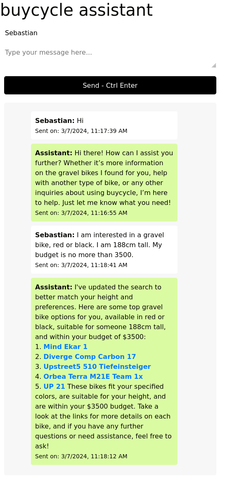
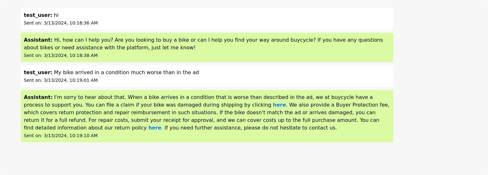

# Crafting a Multilingual, Inventory and and Help Article Aware Assistant with Rust and ChatGPT
One of buycycle's missions is to guilde our users to find the best bike. In the rapidly evolving world of e-commerce, providing personalized and efficient customer support is crucial. To take both goals, we develop a inventory and aware assistant pretrained on how the platform works and customer support best practices.

## Simplified Frontend Development with Rust and htmx
The development of the assistant's frontend was greatly simplified by the use of Rust and Axum, along with htmx. Rust's safety and performance, combined with Axum's modularity, provided a strong foundation for building a robust backend. htmx's ability to handle dynamic content updates made creating a responsive and interactive user interface a matter of hours rather than days. This synergy allowed us to focus on delivering a product that not only performs well but is also straightforward and enjoyable to develop and maintain.
## Integration with ChatGPT
OpenAI's ChatGPT enhances our assistant with advanced natural language processing. It understands and generates responses in multiple languages, ensuring that users can interact in their preferred language. This integration allows the assistant to provide nuanced and contextually relevant support, drawing from a vast knowledge base of cycling information.
Additonally, the API supports tools like Code Interpreter, Retrieval, and Function calling, which can be explored using the Assistants playground or by following a step-by-step integration guide.
Our assitant is implemented as a typical integration of the API:
1. **Create an Assistant**: Define custom instructions and choose a model for your Assistant. Optionally, add files and enable tools like Code Interpreter, Retrieval, and Function calling.
2. **Create a Thread**: Start a conversation thread when a user begins interacting with your Assistant.
3. **Add Messages to the Thread**: As the user asks questions, add their messages to the thread.
4. **Run the Assistant on the Thread**: Generate a response by calling the model and the tools associated with the Assistant.
For a more detailed explanation of each step and additional features such as streaming, you can refer to the official OpenAI documentation on the Assistants API [here](https://platform.openai.com/docs/assistants/overview?context=with-streaming).
## Inventory and Help Article Awareness
The assistant is designed to be fully aware of buycycle's inventory and help articles. It accesses the `{bikes.json}` and `{help_articles.json}` files to provide real-time, accurate information to users. Whether a customer is looking for a specific type of bike or needs guidance on using the platform, the assistant can pull the relevant data and offer tailored assistance.
## How the Assistant Works
1. **Multilingual Support**: The assistant can converse with users in multiple languages, offering a personalized experience to a global audience.
2. **Inventory Awareness**: By making the inventory DB availbable to the assistant, it can recommend bikes from buycycle's inventory that match the user's preferences for category, budget, body height, and color.
3. **Content Awareness**: The assistant uses the our multi-lingual zen desk help articles to answer questions about the website and the buying and selling process. If a query falls outside the scope of the help articles, the assistant directs users to buycycle's contact page for further support.
## Implementation Highlights
- **Scalable Backend**: Built with Axum, the assistant benefits from a robust and modular web framework that scales effortlessly with demand.
- **Dynamic Frontend**: The use of htmx and JavaScript on the frontend ensures a dynamic and responsive user interface, with seamless partial page updates and asynchronous form submissions.
- **Database Integration**: SQLite is used for storing conversation history, providing a lightweight and fast solution for data management.
- **Environment Configuration**: Configuration is managed through `.env` files, allowing for a clean and organized setup process.
## Lessons Learned
During the development of the buycycle Assistant, two key lessons were learned:
1. **Structured Data Queries**: Providing the assistant with specific Python code to query the database and help articles ensures consistent and accurate information retrieval. This approach prevents the assistant from misinterpreting the data, leading to a more reliable user experience.
2. **Dynamic File Referencing**: Dynamically referencing file resources with their respective file-ids after attaching them to the assistant is essential. This method guarantees that the assistant recognizes and utilizes the correct sources, maintaining the integrity of the information provided.
## Showcasing Main Capabilities
The assistant's two main capabilities are showcased in the following images:
- **Bike Recommendations**: The assistant can recommend bikes from the inventory that match the user's preferences, as illustrated in `bike_recom.png`.

- **Help Article Awareness**: The assistant can provide information from help articles to assist users with their queries about the website and the buying and selling process, as shown in `article_awareness.png`.

## Setting Up the Assistant
Developers can set up the assistant with ease, thanks to Rust's package manager and a straightforward `.env` file for environment variables. The assistant is also containerized with Docker, offering a consistent development and deployment environment.

## Experience the Assistant Live
We invite you to experience the Buycycle Assistant firsthand by visiting the live version at [assistant.buycycle.com](https://assistant.buycycle.com/). Engage with the assistant and discover how it can enhance your journey through our platform, whether you're looking to buy a pre-owned high-end sport bike or seeking assistance with our services.

## Outlook: Connecting to Data Science Products
Looking ahead, Buycycle plans to expand the capabilities of our assistant by connecting it to other Data Science products, such as personalized bike recommendations. This integration will leverage user data and machine learning models to further refine the assistant's ability to provide customized suggestions, enhancing the personal touch that Buycycle is known for.

## Repository {#repository-section}

    <article>
        <a href="https://github.com/buycycle/assistant" target="_blank" rel="noopener">
            

                <h2 class="article-title">buycycle Assistant Repository</h2>
                <footer class="article-time">Repo</footer>
            

            

                
            

        </a>
    </article>

