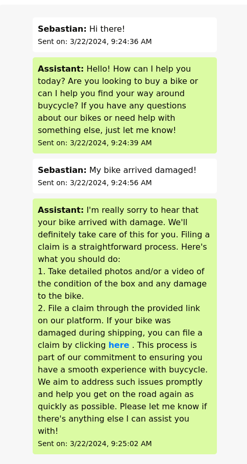

# Crafting a Multilingual, Item and Content Aware Assistant with Rust and ChatGPT
In the rapidly evolving world of e-commerce, providing personalized and efficient customer support is paramount. buycycle has taken a significant leap forward by developing a multilingual, item and content aware assistant. This assistant is not just a chatbot; it's a sophisticated tool built with the safety and performance of Rust, and the cutting-edge language understanding capabilities of OpenAI's ChatGPT.
## The Power of Rust
Rust is a game-changer for building reliable and efficient software. It offers memory safety guarantees, which means fewer crashes and security vulnerabilities. Its performance is on par with C++, making it ideal for high-load services like an online assistant. Rust's powerful concurrency model allows our assistant to handle multiple user queries simultaneously without a hitch.
## Integration with ChatGPT
OpenAI's ChatGPT enhances our assistant with advanced natural language processing. It understands and generates responses in multiple languages, ensuring that users can interact in their preferred language. This integration allows the assistant to provide nuanced and contextually relevant support, drawing from a vast knowledge base of cycling information.
## Database and Help Article Awareness
The assistant is designed to be fully aware of buycycle's inventory and help articles. It accesses the `{bikes.json}` and `{help_articles.json}` files to provide real-time, accurate information to users. Whether a customer is looking for a specific type of bike or needs guidance on using the platform, the assistant can pull the relevant data and offer tailored assistance.
## How the Assistant Works
1. **Multilingual Support**: The assistant can converse with users in multiple languages, offering a personalized experience to a global audience.
2. **Item Awareness**: By querying the `{bikes.json}` file, the assistant can recommend bikes from buycycle's inventory that match the user's preferences for category, budget, body height, and color.
3. **Content Awareness**: The assistant uses the `{help_articles.json}` file to answer questions about the website and the buying and selling process. If a query falls outside the scope of the help articles, the assistant directs users to buycycle's contact page for further support.
## Implementation Highlights
- **Scalable Backend**: Built with Axum, the assistant benefits from a robust and modular web framework that scales effortlessly with demand.
- **Dynamic Frontend**: The use of htmx and JavaScript on the frontend ensures a dynamic and responsive user interface, with seamless partial page updates and asynchronous form submissions.
- **Database Integration**: SQLite is used for storing conversation history, providing a lightweight and fast solution for data management.
- **Environment Configuration**: Configuration is managed through `.env` files, allowing for a clean and organized setup process.
## Lessons Learned
During the development of the buycycle Assistant, two key lessons were learned:
1. **Structured Data Queries**: Providing the assistant with specific Python code to query the database and help articles ensures consistent and accurate information retrieval. This approach prevents the assistant from misinterpreting the data, leading to a more reliable user experience.
2. **Dynamic File Referencing**: Dynamically referencing file resources with their respective file-ids after attaching them to the assistant is essential. This method guarantees that the assistant recognizes and utilizes the correct sources, maintaining the integrity of the information provided.
## Showcasing Main Capabilities
The assistant's two main capabilities are showcased in the following images:
- **Bike Recommendations**: The assistant can recommend bikes from the inventory that match the user's preferences, as illustrated in `bike_recom.png`.

- **Help Article Awareness**: The assistant can provide information from help articles to assist users with their queries about the website and the buying and selling process, as shown in `article_awareness.png`.

## Setting Up the Assistant
Developers can set up the assistant with ease, thanks to Rust's package manager and a straightforward `.env` file for environment variables. The assistant is also containerized with Docker, offering a consistent development and deployment environment.
## Conclusion
buycycle's assistant is a testament to the power of combining Rust's performance and safety with the advanced AI capabilities of ChatGPT. It's an innovative solution that enhances the customer experience by providing real-time, accurate, and personalized support. As we continue to refine and expand its capabilities, the assistant will play a crucial role in making buycycle the go-to platform for pre-owned high-end sport bikes.

## Repository {#repository-section}

    <article>
        <a href="https://github.com/buycycle/assistant" target="_blank" rel="noopener">
            

                <h2 class="article-title">buycycle Assistant Repository</h2>
                <footer class="article-time">Repo</footer>
            

            

                
            

        </a>
    </article>

