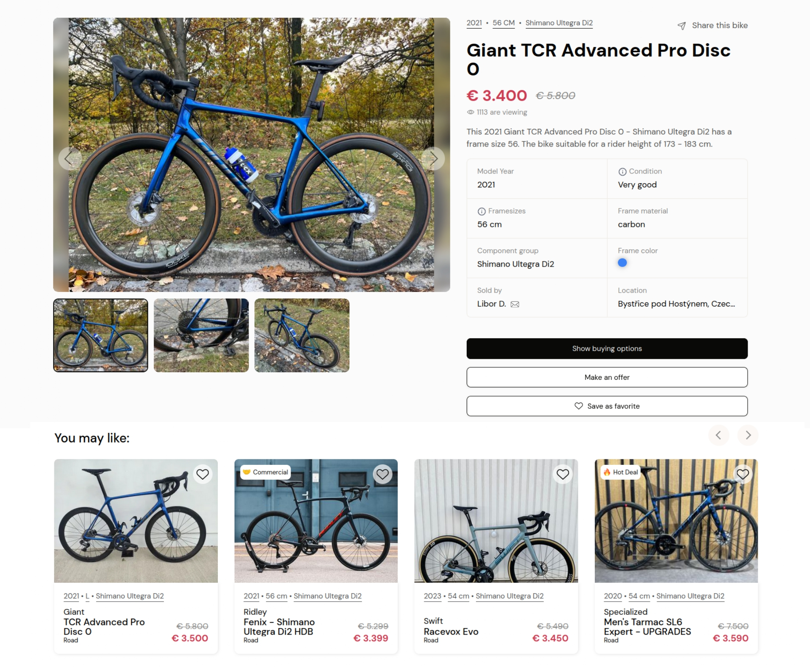
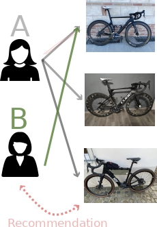
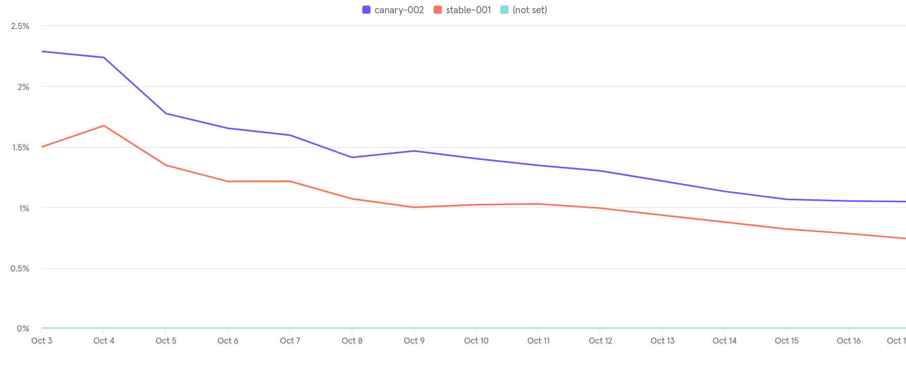

---

title:  Navigating the Pre-Owned Bike Market
description: Buycycle's Personalization Engine
slug: recommendation
date: 2023-12-12T21:10:00+07:00
image: cover.png
categories:
    - Machine_Learning
    - Buycycle
tags:
    - Personalization
weight: 1

links:
  - title: Personalization Engine
    description: Repo
    website: https://gitlab.com/buycycle/recommendation_content
    image: https://github.githubassets.com/images/modules/logos_page/GitHub-Mark.png

---

Buycycle emerges as a transformative platform in the pre-owned bicycle market. A market hindered before by high transaction costs that deterred customers from considering used bikes over buying new. These costs, ranging from complex cross-border shipping to concerns over buyer and seller trust and prevalent information inefficiencies, are now being mitigated through Buycycle's comprehensive service offerings.

By centralizing services such as streamlined international shipping, secure escrow payment systems, and robust insurance options, Buycycle aims at reducing the barriers to buying and selling pre-owned bikes. This not only elevates the value proposition of second-hand bicycles but also enhances market efficiency, making pre-owned options more competitive against new purchases.

Environmental benefits are inherent in our business model, promoting bicycle reuse, reducing CO2 emissions, and supporting sustainable consumption. Economically, Buycycle enables more affordable cycling options, fostering broader adoption and healthier lifestyles while lessening dependence on costlier transport.

One key tool to achieve this is through Democratizing Bike Market Information, providing detailed bike insights to inform buyers and sellers alike.

## Democratizing Bike Market Information
A core mission of Buycycle is to establish a level playing field by ensuring all market participants have access to comprehensive and symmetrical information. To this end, we offer a detailed buyers guide to empower consumers, provide precise bicycle valuations, and facilitate the connection between buyers and sellers by aligning the right bikes with user preferences. Achieving such transparency is made possible through our commitment to data-driven services, which forms the cornerstone of the Buycycle platform.

Personalization emerges as a natural progression in our quest to democratize market information. By leveraging the power of machine learning, we aim to curate a tailored experience for each user, ensuring that the wealth of information available is not only accessible but also actionable. This focus on personalization is not just about enhancing user experience—it's about transforming data into meaningful interactions that resonate with the individual needs and desires of our customers.

It is with this vision in mind that our data science team embarked on the development of our inaugural in-house machine learning model.

## Data-Driven Personalization
Imagine a user overwhelmed by the choice of 20,000 bikes on sale. They need assistance in finding the perfect fit, which may not always be readily available due to the nature of pre-owned stock. The recommendation system is tailored to help users navigate this vast selection effectively. On the other hand we need to ensure if the exact bike a user wants isn't in stock, they won't leave the platform empty-handed. Instead, they'll be presented with a curated selection of alternatives that meet their needs and preferences, making the shopping experience personalized and efficient.

The recommendation system is designed to address four key aspects:
- **Relevance:** Ensuring that the bikes recommended meet the user's specific needs and preferences.
- **Novelty:** Introducing users to bikes they may not have previously considered or known about.
- **Serendipity:** Surprising users with bikes that they might find unexpectedly appealing.
- **Diversity:** Offering a wide range of bikes to prevent redundancy in recommendations.

## Personalization Engine
Buycycle's Personalization engine employs a two-tiered approach to cater to users with varying levels of historic feedback data.

The first tier is a content-based model that suggests bikes based on specific attributes such as type, size, and brand, ideal for users with clear preferences or limited interaction history.

The second tier utilizes collaborative filtering, which leverages user behavior and feedback to refine recommendations. This model identifies patterns in user interactions to suggest bikes that similar users have shown interest in, enhancing personalization as more data becomes available.

Our system is built as a Flask app, hosted on Kubernetes for scalability and managed with ArgoCD for continuous deployment, ensuring reliability and up-to-date functionality.
For a deeper look into our system, visit our [Repository](#repository-section) section.

### Repository {#repository-section}

    <article>
        <a href="https://gitlab.com/buycycle/recommendation_content" target="_blank" rel="noopener">
            

                <h2 class="article-title">Personalization Engine</h2>
                <footer class="article-time">Repo</footer>
            

            

                
            

        </a>
    </article>

### Content-Based

Our Personalization engine's content-based filtering is designed to suggest bikes based on their features, independent of user history. This is crucial when user preferences are unknown, focusing instead on the attributes of the bikes as shown in Figure 1. The model compares bikes' characteristics, such as brand, frame size, brake type, and color, to identify similar options.

<figure>
<table>
<tr>
<th><strong>id</strong></th>
<th><strong>template_id</strong></th>
<th><strong>price</strong></th>
<th><strong>msrp</strong></th>
</tr>
<tr>
<td>465551</td>
<td>18128</td>
<td>3400.0</td>
<td>5800.0</td>
</tr>
<tr>
<th><strong>bike_created_at_year</strong></th>
<th><strong>bike_created_at_month</strong></th>
<th><strong>bike_year</strong></th>
<th><strong>sales_country_id</strong></th>
</tr>
<tr>
<td>2023</td>
<td>11</td>
<td>2021</td>
<td>137</td>
</tr>
<tr>
<th><strong>bike_type_id</strong></th>
<th><strong>bike_category_id</strong></th>
<th><strong>mileage_code</strong></th>
<th><strong>motor</strong></th>
</tr>
<tr>
<td>1</td>
<td>1</td>
<td>3000_10000</td>
<td></td>
</tr>
<tr>
<th><strong>city</strong></th>
<th><strong>condition_code</strong></th>
<th><strong>frame_size</strong></th>
<th><strong>rider_height_min</strong></th>
</tr>
<tr>
<td>Bystřice pod Hostýnem</td>
<td>3.0</td>
<td>56</td>
<td>173.0</td>
</tr>
<tr>
<th><strong>rider_height_max</strong></th>
<th><strong>brake_type_code</strong></th>
<th><strong>frame_material_code</strong></th>
<th><strong>shifting_code</strong></th>
</tr>
<tr>
<td>183.0</td>
<td>hydraulic</td>
<td>carbon</td>
<td>electronic</td>
</tr>
<tr>
<th><strong>bike_component_id</strong></th>
<th><strong>color</strong></th>
<th><strong>family_model_id</strong></th>
<th><strong>family_id</strong></th>
</tr>
<tr>
<td>14</td>
<td>#3B82F6</td>
<td>8727</td>
<td>3088</td>
</tr>
<tr>
<th><strong>brand_id</strong></th>
<th><strong>quality_score</strong></th>
<th><strong>is_mobile</strong></th>
<th><strong>currency_id</strong></th>
</tr>
<tr>
<td>45</td>
<td>30</td>
<td>0</td>
<td>2</td>
</tr>
<tr>
<th><strong>seller_id</strong></th>
<th><strong>is_ebike</strong></th>
<th><strong>is_frameset</strong></th>
<th></th>
</tr>
<tr>
<td>151982</td>
<td>0</td>
<td>0</td>
<td></td>
</tr>
</table>
<figcaption>Excerpt of bike feature data</figcaption>
</figure>

For example, the bike with id 465551, detailed in our bike feature table, has a frame size of 56 and a color code referencing blue.

Using euclidean distance between the feature vectors (a concept developed 300BCE), we measure the similarity between bikes in a feature space, ranking them by similarity scores. We found that euclidean distance allows the weighing of features according to their importance over cosine similarity.

As Figure 1 demonstrates, the content-based recommendations closely match the featured bike in key features such as components level, price, size, and color. This ensures that even without user input, our recommendations are likely to align with what users might find appealing and within their expected budget and aesthetic preferences.

In summary, our content-based filtering leverages a detailed bike feature table to present users with bike suggestions that are similar in price, size, and color, ensuring relevance and potential appeal in every recommendation.
<figure>
  
  <figcaption>Content Based Similarity</figcaption>
</figure>

### Collaborative Filtering
Our collaborative filtering model personalizes bike recommendations by learning from user behaviors like views, add to favorites and purchases. It uses machine learning, stylized in Figure 2, to predict interests from similar users' patterns, ensuring relevance.

For instance, if User A likes both aero and gravel bikes, we might suggest gravel bikes to User B. She is so far only interested in aero bikes but her similarity to user A suggests that she might be interested in gravel bikes too, introducing novelty and serendipity. This method also diversifies options, preventing monotonous suggestions. Our hybrid approach, based on [Kula, 2015](https://arxiv.org/abs/1507.08439), combines content-based insights with collaborative filtering, offering users a dynamic selection of pre-owned bikes that align with their preferences.

<figure>
  
  <figcaption>Collaborative Filtering</figcaption>
</figure>

This model takes into account user-item interactions and extracts latent features to inform its recommendations, incorporating elements of swarm intelligence.

## Evaluating Recommendation Strategies: A/B Testing Insights

In our pursuit to refine recommendation accuracy, we conducted a two-week A/B test, as depicted in Figure 3, to compare the effectiveness of purely content-based filtering against a hybrid approach that combines content-based and collaborative filtering.
During this trial, we observed user interactions with recommendations generated by both models. The content-based model operated solely on bike features (stable), while the hybrid model also considered user behavior and preferences (canary).

The A/B test results were compelling, revealing a 40% increase in conversion rates—from viewing recommendations to placing orders, when the hybrid model was employed over the content-based model alone.
Figure 3 showcases the A/B test outcomes over the 14-day period, providing clear evidence that integrating collaborative filtering with content-based insights leads to a more engaging and effective recommendation system. This hybrid approach not only aligns with users' specific tastes but also introduces them to new bike categories they might not have considered, enhancing the overall user experience.

<figure>
  
  <figcaption>A/B Test Results</figcaption>
</figure>

## Expanding Personalization Through Advanced Applications
Buycycle's inaugural machine learning model, our personalization engine, is a cornerstone in our quest to revolutionize the pre-owned bicycle market. It tackles key challenges such as information inefficiencies by delivering personalized bike suggestions, empowering our users to make well-informed decisions. This advancement is a significant stride towards bolstering Buycycle's dedication to market efficiency, environmental sustainability, and economic accessibility.

As we refine this first model and embrace cutting-edge technologies, we're excited to broaden its use, including personalized email campaigns and real-time personalization through streaming data.

These initiatives are just the beginning of our journey into machine learning. We anticipate starting new endeavors and applying our learnings to continuously innovate, keeping us at the vanguard of the marketplace, enriching the user experience, and ensuring equitable access to cycling options.

## Paper

   <embed src="recommendation-2.pdf" type="application/pdf" width="100%" height="600px" />

