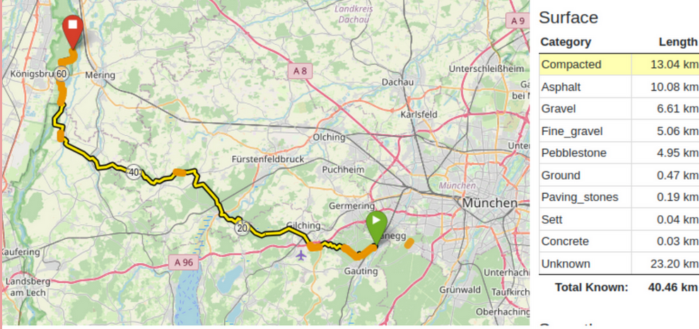

Deciding where to cycle is one of the most important ingredients for a good time on the bike. In the past, for the ideal route, you needed a friend that knew the surrounding roads inside out, or you spent hours studying some map. Today, it's a lot easier: two taps with your finger and we've got a great starting point to refine the perfect route for your tour.
And for that it doesn't even matter if we want to make the daily commute to work a little nicer or if we want to spend several days riding through the Alps Bikepacking. So in today's blog post, we'll introduce you to a few of the most helpful route planning tools to make your next cycling adventure even easier to prepare and more enjoyable to experience.
We will intentionally focus on opensource tools that provide the most customization and provide a way to actively contribute to the tools and underlying maps.

# OpenStreetMap

<figure>
  
  <figcaption>Surface categories make it easy to tweak surface types.</figcaption>
</figure>

In fact, the vast majority of bike-specific routing solutions, which also take into account important criteria such as preference for elevation changes, road surfaces, or avoiding dangerous roads, are based on OpenStreetMap.
This platform offers you a free, editable map of the world created by a global community of volunteers. Users can share, edit, and use all kinds of geographic data on OpenStreetMap, so you can find the very last trail, viewpoint, or hidden bike path. Whether in the city or off the beaten path - OpenStreetMap knows every spot. Even bicycle parking and repair stations, which is particularly practical for cyclists. And if it is not there yet, you can add it to the maps database.
What is clear is that this sheer mass of data and detail could never in a lifetime be collected and continuously updated at this density by a single company. OpenStreetMap is therefore a true boon for route planning, from the Community, for the community.

# BRouter

<figure>
  
  <figcaption>Road bike minimized traffic routing from Munich over the Stelvio pass to Meran.</figcaption>
</figure>

Planning and riding a great route in general consists of two parts, the planning before and the navigation during your ride.
BRouter is another open source project (based on OpenStreetMap) that covers the planning phase. And it works both in the app and on the web.
Here you can find various maps in satellite or topographic view, as well as cycling-specific overlays that give you access to entire libraries of bike trails (including those from waymarked trails saved routes). Additionally, you will also find Gravel-, mountain bike- or road bike routing profiles, which you can even customize to your individual needs in a second step. A great feature is the surface and road type view. Here you can see how much of your ride is the types you prefer and by clicking on them get highlight live on the map, a great tool for refining the route. Once satisfied, you only need to save the map as a gpx file and download it on your navigation device.
In addition, and this is unfortunately still relatively rare among navigation software, your data is neither shared with third-party providers, nor tracked or stored in any other way. You are also spared from in-app purchases or advertising.
All this makes BRouter a great tool for planning your next trip, although the rich interface might take some time and effort to get used to.

# osmAnd

<figure>
  
  <figcaption>A tour through the Berlin Tiergarten as suggested by osmAnd with the Wikipedia plug-in active.</figcaption>
</figure>

The gpx file from BRrouter can be imported into any navigation device. However, if you just want to use your phone, there are great apps that guide you safely and with ton of additional features. The app osmAnd is one of them and offers two crucial advantages: Bike-specific maps and turn-by-turn voice navigation. For you, this means: Stash your phone in your pocket or mount it on your handlebar and off you go.
With several available plug-ins you can also connect your favorite weather app, the now familiar BRouter for offline maps, Topography for elevation profiles or even Wikipedia with osmAnd. The latter accesses your location while driving and informs you about surrounding national parks, statues, monuments, cities and... Well, about pretty much everything, that you cycle past that has a Wikipedia entry. That way you challenge your body and educate yourself at the same time!
The app is free, but you have to pay extra for a few plugins. Fortunately, this is not absolutely necessary, as the free version already offers (almost) everything you need. Pro tip: The developers want to foster open source and give a free pro version when using the alternative app store F-Driod.
OpenStreetMap, BRouter and osmAnd are all opensource projects. While their data base is huge and their opensource character makes them great free, democratic and tools that benefit us all, they can be a bit hard to navigate and use. So if you're looking for something a bit more user-experience oriented, these next suggestions might be just right for you!

